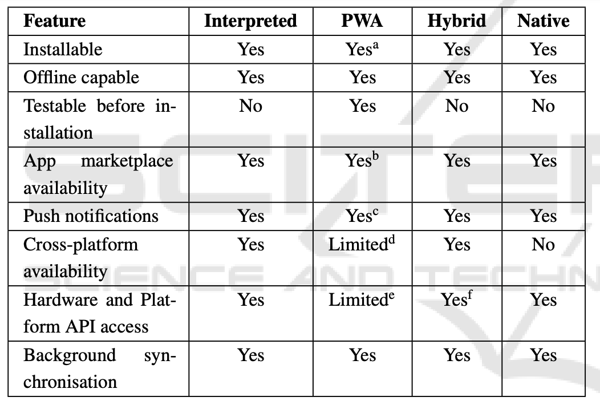
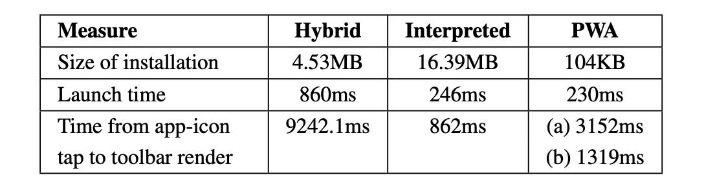
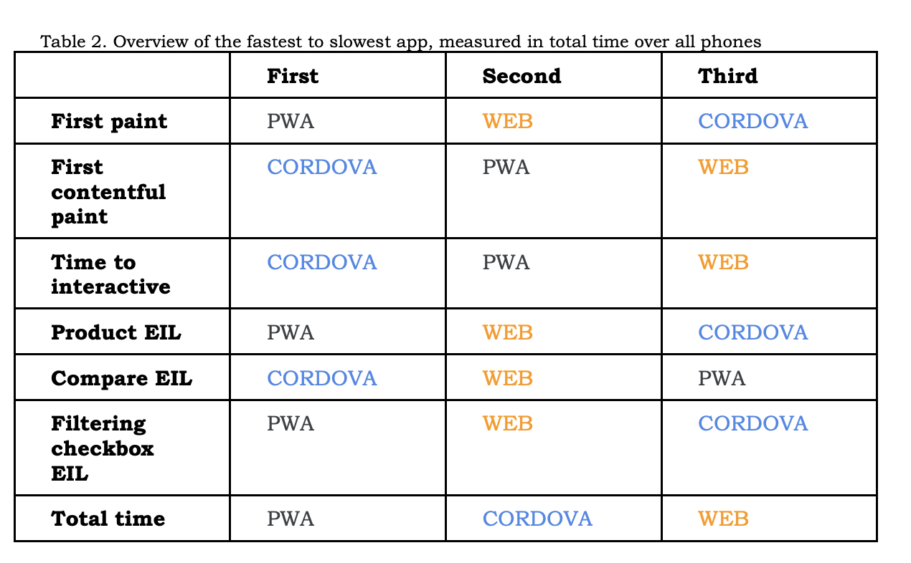

## PWA vs Native App vs Hybrid App

A core decision in the initial planning and development of Kerbit was to determine the type of app that it would be built as. To make this decision it is important to consider the difference in functionality of progressive web apps, native apps, hybrid apps, and interpreted apps, and the current academic research on these different approaches to mobile app development, as well as the technology experience of the developer.

## Developer experience

In this instance, it seems unwise to choose native app development for multiple reasons. Kerbit is intended to be multi-platform and to do this as native apps would require developing the same app twice because of the platform specific code bases and developer environments needed when support for multiple mobile platform (Heitkotter et al.). This would not only require the developer to learn the native languages but also double the development time which would not be ideal for this time constrained project.

The additional time needed to learn the languages and develop for the two separate platforms rules out this approach to mobile app development, as it is unlikely that this would be achievable in the time given.

## App type comparison

### Features

This table from Biørn-Hansen et al (2017) show a good base of the differing levels of functionality ignoring the native column as this has already been ruled out as an option, but there have been some changes since when this was published. Most notably, the cross-platform compatibility is now fully supported with PWA's as Safari now supports service workers. Additionally, the hardware and platform API access has greatly advanced since the publishing of this article with many web API's and HTML5 API being fully functional in the standalone or fullscreen modes the PWA's run in.

Given that there is not a large variance in the ability of each of the app development types, other comparisons of the app types will have to be considered.

### Install size, launch and render time

The above table displays the time taken for 'installation size, launch time and render time' (Biørn-Hansen et a, 2017, p.348). This table shows the two major drawbacks in using hybrid apps, is that there are performance issues that arrise due to the 'extra layer between the source codes which may cause a lack of performance' (Jaman, 2019). Additionally, it shows a signifiant issue with interpreted apps in that they are far larger than the rest to install on to a users device. For the PWA, it shows an issue with render time when the browser is not running in the background (shown as (a) on the table), however, there is still a reasonable render time when the browser is running in the background (shown as (b) on the table).

### Additional speed metrics

Because of the variance in the speed of render time for the interpreted, hybrid and PWA's more detail on the speed of each type of app is needed.

_EIL: estimated input latency_

In the above table Kvist and Mathiasson (2019) detail the fastest to slowest apps on varying measures. Focusing on the PWA and Cordova (hybrid app) results, the PWA app tested was most frequently the fastest in the majority of categories, rating as the fastest in 4 of the 7 categories and was only deemed as the slowest once. Where as, the Cordova app which did rate the fastest in 3 of the categories, but was also the slowest in another 3 categories, this is another example of the aforementioned performance issues associated with hybrid apps.

## Conclusion

Considering that progressive web apps have both the smallest install size, the fastest launch time, a reasonable render time when the browser is loaded in the background, and the best overall speed in a number of different loading metrics, it has been determined that a progressive web app is the best way to proceed with the development of Kerbit.

## References

Heitkotter, H., Majchrzak, T. A., and Kuchen, H. 2013. Cross-Platform Model-Driven Development of Mobile Applications with MD2. In: _Proceedings of the 28th Annual ACM Symposium on Applied Computing, March 2013, Coinbra Portugal_. New York: Association for Computing Machinery, pp.526–533.

Jaman, S. 2019. _A Comparison Review Between Progressive Web App vs Native App vs Hybrid App._ [Online]. [Accessed 19 November 2019]. Avaliable from: [https://medium.com/@shifat.jaman/a-comparison-review-between-progressive-web-app-vs-native-app-vs-hybrid-app-6681fde69509](https://medium.com/@shifat.jaman/a-comparison-review-between-progressive-web-app-vs-native-app-vs-hybrid-app-6681fde69509)

Kvist, J and Mathiasson, P. 2019. _Progressive Web Apps and other mobile developing techniques: a comparison_. Bachelor thesis: Malmo University

Biørn-Hansen, A, Majchrzak, T, and Grønli TM. 2017. Progressive Web Apps: The Possible Web-native Unifier for Mobile Development. In: _Proceedings of the 13th International Conference on Web Information Systems and Technologies (WEBIST 2017), January 2017, Porto, Portugal._ San Francisco: Science and Technology Publications, pp.344-351
