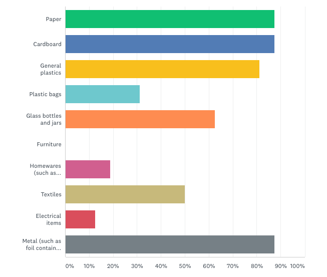
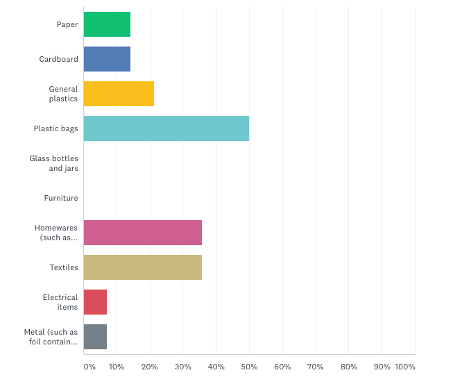
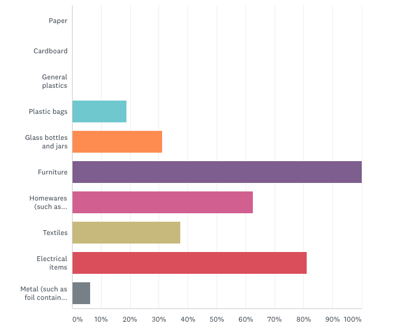
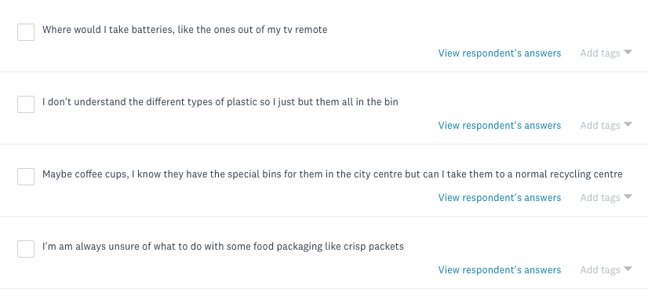
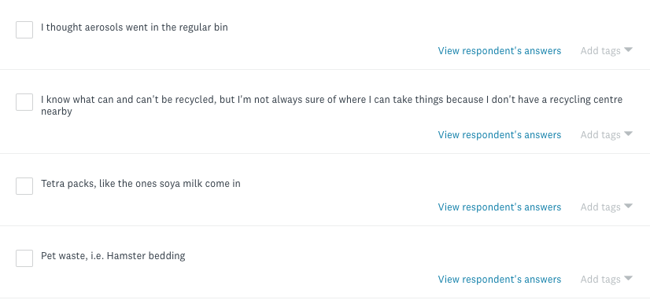

## Aims of the survey

The aims of this survey is take the potential categories that were discussed in a previous post and see if respondent would incorrectly and correctly recycle the items in these categories.

This is to determine:

1. if all of the categories are necessary, for instance, if paper is alway recycled correctly it may be unnecessary to have an entire category for it.
2. Which categories are recycled in correctly most often, thus making them more likely to be checked through Kerbit meaning that category has to have a high level of confidence to help stop people recycling wrong.
3. If there are any additional items that the respondents are unsure of whether they are recyclable.

### Predicted results

I am expecting there to be very little confusion among commonly recycled items such as cardboard and plastic but higher levels of confusion with items such as homewares and electrical items. Additionally I expect there to be a high level of confusion with glass as unlike most other places in the country, in Leeds glass has to be taken to a recycling centre, so it is likely that residents that have lived in other counties may recycle glass incorrectly.

### Demographic

I distributed this questionnaire across various social media channels and asked Leeds residents only to fill it in. The main channel I distributed the survey over was a network called Nextdoor as it shares posts to people in the same area to you. I felt this was the best place to distribute it as it would prevent people not from Leeds answering. Additionally, the area local to myself has a population mix of students and family/professional households so I would hope to get a good mix of answers from people who have moved to Leeds and those who have lived here fo for a considerable amount of time

## Results

In total over the course of a week I received 48 survey responses.

### Q1

Tick all the options that you think should go in the green bin.

The most significant results from this graph is:

50% of respondants think that textile waste can go in the green bin (the regular recycling bin).

Over 60% of respondants think that glass can be recycled in the green bin.

A small number of respondants think that homewares and electrical can be recycled in the green bin.

### Q2

Tick all the options that you think should go in the black bin.

The most significant results from this graph is:

50% of respondants think that plastic bags go in the black bin (the general waste bin).

In general small to moderate numbers of people think that a good portion of these items, which are all recyclable, should go in the general waste bin.

### Q3

Tick all the options that you think should be taken to a recycling centre or recycling point.

While this answers in this category are mostly correct, there were a small number of incorrect answers of respondants thinking items had to be taken to recycling centres when they could just be put in the recycling bin.

### Takeaways

From the responces to these 3 questions I have determine that:

- All the proposed categories should stay as they all have instances where people answered incorrectly (aside from furniture which I will come to later).
- The confidence level of detecting plastic bags, glass and homes needs to be very high as these items are commonly misplaced when recycling

### Q4

If there are any items that you would be unsure of where to recycle, please add them below.

Below are some of the key responces I picked out of the results, as this question didn't require an answer it had far less responses than the others.

The key takeaways from these answers are that there are some specific items that people are unsure of, such as batteries, tetra packs, food packaging and coffee cups because of this, I will consider adding specific item categories that cover items like these if the timeframe of the project allows for it.

Additionally, the answer that refers to not being sure where to take things because they don't have a recycling center near by is one of the reasons why I'm keeping the furniture category in. As although it was answered correctly in all of the survey responses, the responce that Kerbit will give when shown furniture will show users their nearest recycling centre or point and I think it is best to maximise the responses where users will the shown this information if it is an issues for some people.

-
