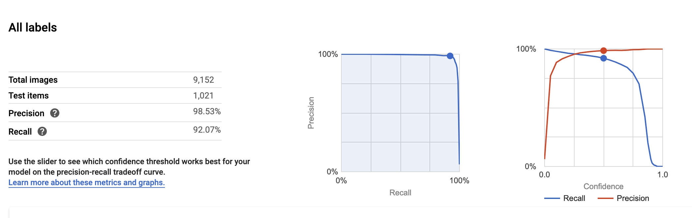

At this point almost all of the categories have been added after conducting the category survey and a new workable model has been trained so this is a good point to draw some comparisons to the model that was submitted with the prototype and dicuss any pertinent points about the model.

## Prototype Model (February)

_Prototype data set count: 2,546_

## Current model (March)

_Current data set count: 9,152_

## Take away points

### Increased dataset

The most noticable change is that the model dataset has rapidly increased. This due to the experience gained after conducting the model training for the prototype which gave me the knowledge of what the best kinds of images to use are and how to get the best variety of images. Additionally, fully determining the categories needed from the survey was very helpful as it gave the model a realistic point to work towards rather than attempting for Kerbit to know everything which isn't something that is possible in this timeframe with just one person. The availably of open-source datasets also has to be partially credited for this huge increase in data as set containing data on items such as chairs and tables is already available, this is not to say that the open dataset are simply input straight into the model, all the images in them have to be vetted, edited and removed where necessary to ensure to functionality of the model.

### Reduced precision and recall

The model precision (A high precision model produces fewer false positives, which is when something is incorrectly labelled) and the recall (A high recall model produces fewer false negatives, which is when something should have been labelled but wasn't) dropped from the prototype model to the current version.

While it is only a small drop in precision and recall on the machine tested training sets, the change in the model is more noticable under real world use with it being less accurate. However, this effect is to be expected as when training a model there is a certain amount of accuracy that has to be sacrifced for a model with more breadth, thus a model with more categories is more likely to produce inaccurate predictions because there are more opportunities for confusion. This negative correlation in model accuracy and model bredth is possible to be negated but only when there is large amounts of time and processing power available which is why Google AutoML and IBM Watson's pre-trained models are far more accurate than what Kerbit will ever be as they have teams of engineers committed to them.

Additonally, there will be a certain amount of accuracy sacrificed as the model is deployed as a 'Mobile best trade-off' model, which allows a certain loss in accuracy to allow for better speeds and lower latency on edge devices and when devices are offline.

## Confusion Matrix change

The main differences in the two confusion matrix is that in the more recent model their are far fewer confusion points with high percentages, for instance the hight confusion percentage in the prototype model was 8% confusion between metal and glass where as on the current model the hight confusion level is 4% on various categories.

This is a positive change because although there are more instances of where the model was mislabelling objects, the frequency of confusion is lower.

It is also worth noting that certain confusion points are irrelavant to the final working of Kerbit. For example, where there is a 4% confusion between microwaves and toasters, this won't matter on for Kerbit users as the responce that they will see is that Kerbit has predicited that it is an electrical. This is true of all items that fall into the electrical or furniture categories.

## Conclusion

To summarise, the model is progressing in a exceptionally positive way and with a good level of accuracy. Especially when considering that while most models will reach higher levels of accuracy, they are either trained by teams of academics for research purposes over large amounts of time or by large corporations with lots of development experience and a wealth of funding, this is been entirely trained by one person.

I am very happy with the model accuracy when using the app and while it will never be 100% accurate all the time as machine learning is not perfect I would say that under current usage it is accurate between 70%-80% of the time and I am very happy with that.

There is still another category to add, which is the fabric/textiles category, which will be added shortly once the data collection for this category has finished and has been reviewed.
