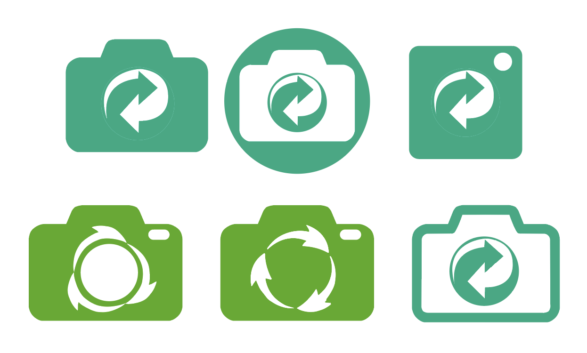
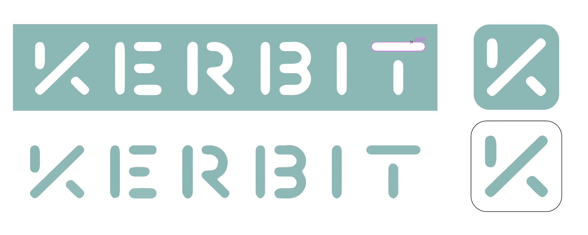
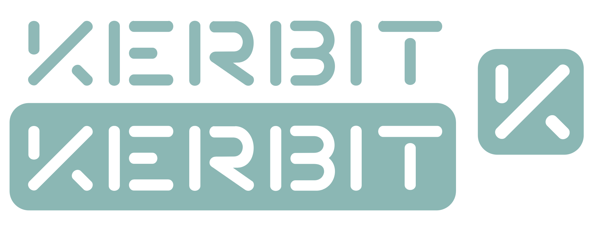

### Initial logo ideas

To begin with I intended to have a more descriptive/graphical logo. Originally I was playing around with trying to combine a flat icon-esque camera with the arrows commonly associated with recycling, combining the two main features of Kerbit, using the camera to assist with recycling. However, these experiments did not render a logo idea/design that I was happy with, examples of some of the experimental logo designs can be seen below. I felt that the design ideas seemed to be too literal in what they were trying to convey and looked very generic in that they could probably be applied to any recycling app.

### Move to typographic style

After deciding that a graphic logo wasn't working for the style that I wanted to achieve, I decided to experiment with a typographic logo. Inspired by the Tesla logo and the stencil type letters that is often used to paint numbers on people's bins, I came up with the logo variants that can be seen below.

This style was much preferred over the descriptive/graphical logos above, it also lent itself much better to being an app icon. However, from feedback given about the logo it was clear that the logo needed refining in its composition to make it look cleaner and easier to read.

### Refining the logo

Below is the refined version of the typographic logo. The lines of all the letters are more consistent, spaces between them are even, and the sizing of all the letters are even.

This version looks far cleaner and more finished and I think it is more readable that the original version of the typographic logo. I also think it is truer to the inspiration of stencil letters in this iteration.

I am very happy with the logo in this current iteration, but I will seek feedback on it from potential users and other designers to get further suggestions on improvement, especially on the spacing of the lettering as I am unsure in they are too close together in this iteration and should be moved further apart.

