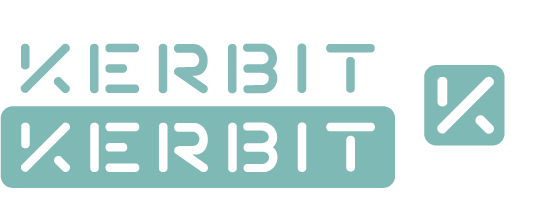

After refining the logo design, information about which
[can be found here](https://blog.samroebuck.dev/testing-and-evaluation/logo-development/), the refined logo design was taken to be evaluated by users and other designers. They too came to the same conclusion that I wrote about in at the end of the aforementioned article, that being that the lettering was too close together.

From this feedback, the logo has since been updated. Below is the final iteration of the logo.

