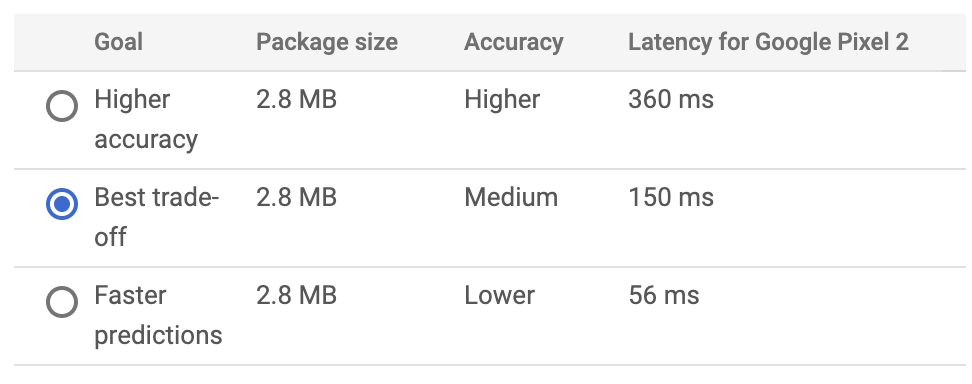

## Areas for improvement

From the prototype feedback the main areas of improvement were as follows:

1. The app can be slow when identifying images
2. The conditions under which the image is taken seem to be critical for the objects to be identified
3. The user experience had not yet been implemented
4. The feedback noted that as 'recycling procedures and regulations vary across the country, does the app also need to query the user’s location and then provide accurate information based upon which city council the user’s property is located within?' this shows that although it was written about in the pitch document, it is not clear that the app is solely meant for the district of leeds.

## Response and actions

1. Throughout the development of the measures have been taken to improve the speed of the app in general and specifically for speeding up the image identification, for instance:
   - Developing the app as a PWA will result in better speeds than if developed as a native or hybrid app, more can be read about this decision and the different app types [in this post](https://blog.samroebuck.dev/literature-review/app-type/).
   - Code splitting has been implemented throughout the app where possible to segmenet the production bundle and therefore reduce loading speeds
   - All images have been optimised for web use
   - The model is trained for edge devices, with the accuracy-speed goal for the model to be 'Best trade-off' meaning some model accuracy is lost to ensure better speeds. The below images shows how the different options for training a model for edge devices
     
     This shows how opting for a slightly lower accuracy can improve the latency by almost 2 seconds. While the speed could be further improved by reducing the accuracy of the predictions further, this was not deemed an option as it was felt as it would be too harmful to the accuracy of Kerbit.

- The size of the model has also be constrained to help with the speed of the image identification, constraining the amount of categories and learning the model has to do will keep the size of the deployed model lower and help improve app speeds.

_NOTE: due to the device processing power needed to run the computations that are needed to produce a responce from a machine learning model, the speed of the prediction will vary on different devices and will undoubtedly be slower than apps that do not implement these features as it is quite an intensive process so to compare Kerbit's performance to standard applications is somewhat reductive._

2. Variation in image type, location and quality has been added to the dataset from which the model is trained from. Initailly I expected this to greatly reduce the need for photos to be taken in optimal conditions, however, it definately hasn't had as dramatic effect as I thought. This is likely due to a combination of the way image classification models have to be trained and the circumstances under which the model is being deployed. Successful image classification is achieved by providing a large dataset of clear images that contain a single label, this means that when training the model, the images have to be clear and ideally on a plain background as the AI, in this case Google AutoML, has to be able to understand what item in the image corresponds to the label. Thus, additional cluttered or blurred images will result in higher levels of confusion in the model and result in false negative and false positives as the data from which the model is predicting a category is unclear. As for the conditions under which the model is deployed, as aforementioned the model is exported under a 'best trade-off' deal, reducing accuracy for additional speed, the recommendation of optimial image conditions is also necessary due to this trade off as the model has a higher likelihood of producing a true positive result in the best trade-off model when there is as little area for confusion as possible.

3. As of the time when the prototype feedback was given, the interface has been fully implemented, been through some user testing and has had some changes made as a result of that.

4. Due to the clear miscomminication that the app is intended to be for Leeds based usage. This information has been clearly added to the main view of the website to and within the 'how to' section of the app in order to minimise this confusion happening again.
