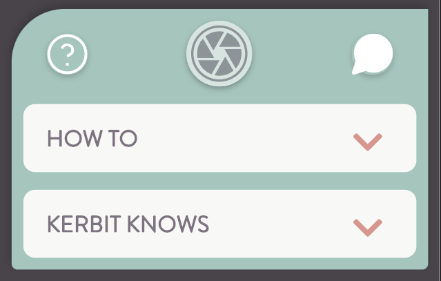
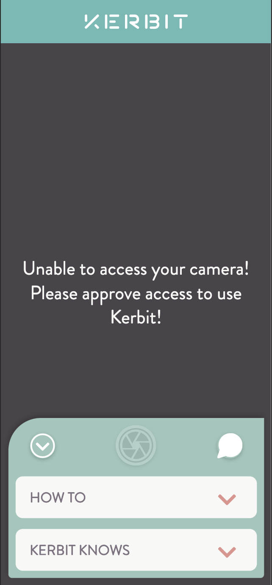
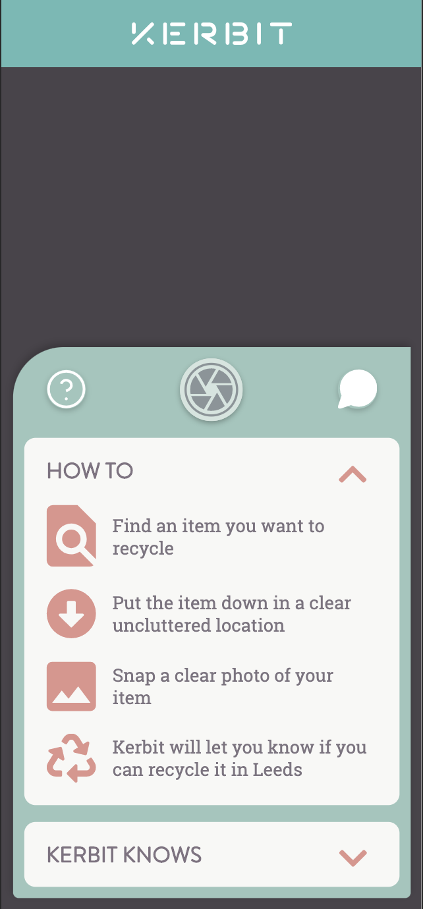
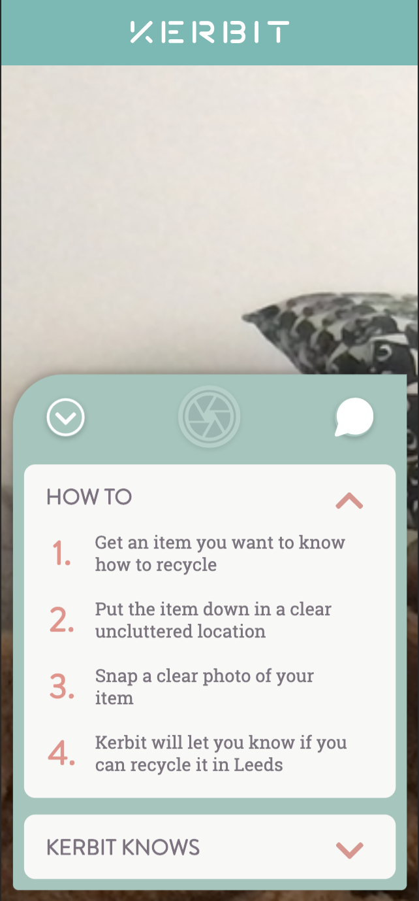
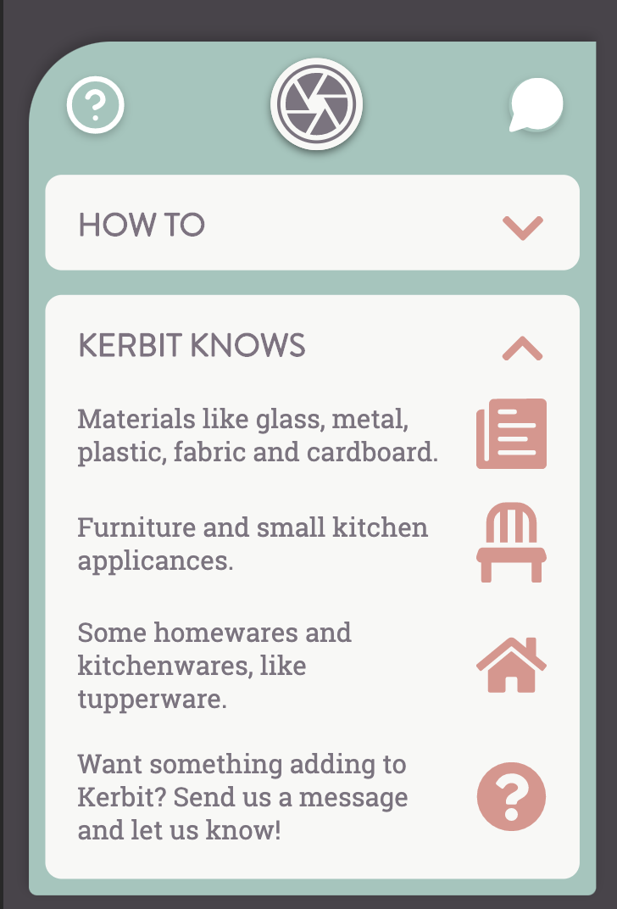
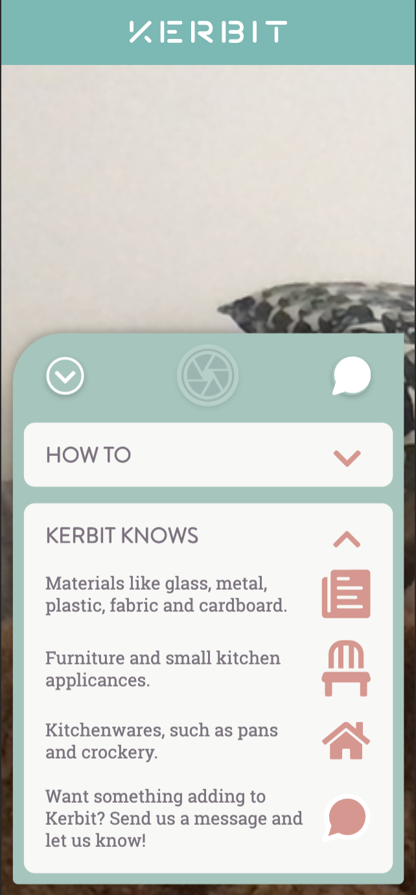

After the responses from the second round of user testing, (which ideally would have consisted of more participants but accessing groups people for user testing is somewhat undoable in the current pandemic) there have been some changes to the user interface of the app.

## Main control bar changes

In the user testing, the participant noted that the question mark button did not show clearly that it would collapse that section. This was due to this functionally not being fully implemented at the time of testing, that it was odd that a photo could be taken when the help section was active, and that there was no response when the camera access was denied and they were still able to take a photo.

| Original Design                                          | New Design                                     |
| -------------------------------------------------------- | ---------------------------------------------- |
|  |  |

The decision was made to replace the the question mark button with a down arrow icon when the help view was action, it was felt that it made it clearer that it was the button to be used to collapse away this part of the control bar than the ? button, especially when the user first loads the app as the how to guide is displayed by default and the user doesn't have the prior knowledge that the button opens the section.

The shutter button has also been disabled and made transparent when this view is active so that users cannot take photos when part of the screen is covered by the help information as this was brought up in the second round of user testing as being unusual functionality.

Additionally, when a user denies camera access an error message has been added, and the same disabled and transparent button is used so users cannot attempt to take photos at this point.

## Help section changes

The user testing revealed to issues with the icon usage on the How To and Kerbit Knows sections within the Help view, these have been rectified using suggestions from the users of what would be clearer icons to implement.

| Original Design                                    | New Design                                        |
| -------------------------------------------------- | ------------------------------------------------- |
|  |    |
|     |  |

In line with the user comments about the icons in the how to section being mistaken for buttons, these have been exchanged for numbers to they better signify that this is a step by step guide on how to use the app. Also the last icon on the Kerbit Knows section has been exchanged for the same message icon that is on the main control bar and also links to the contact page, this was to improve continuity as the user thought that because the text next to this icon was about messaging that it should have the same button as the messaging button on the main control bar.

## Contact page changes

There was a minor bug where the user was unable to scroll on the contact page, this has now been fixed.
