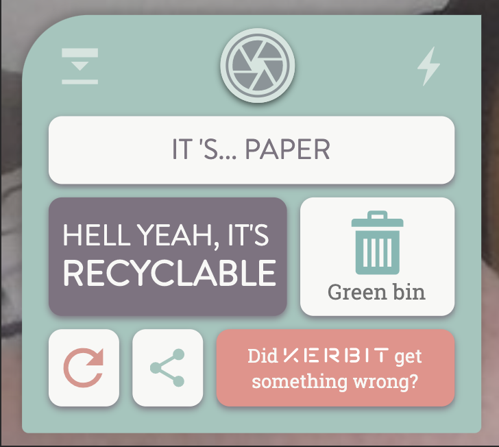

After the responses from the user testing, (which ideally would have consisted of more participants but accessing groups people for user testing is somewhat undoable in the current pandemic) there have been some changes to the user interface of the app.

## main control bar changes

In the user testing, the participant noted that the flash button did not work. This was due to this functionally not being fully implemented at the time of testing. Upon taking the steps to fulling implement this, it was discovered that that web API that handles that controls that can be used on a camera are completely unsupported on iOS devices. Due to the fact that iPhones take up a large part of the phone market it was decided to remove this feature in favour of something else.

Additionally, the old help button was noted as being confusing in the user testing. Originally it was meant to symbolise the opening and closing of the control bar so that the user could see the how-to section, however, user feedback suggests that this is not clear and it should be changed.

| Original Design                                    | New Design                                              |
| -------------------------------------------------- | ------------------------------------------------------- |
|  |  |

The decision was made to replaced the flash button with a contact button, originally this option was only available after taking a photo and receiving the prediction. This was chosen as the replacement as this is for reporting any issues with Kerbit or any additional categories that users would like to have added to what Kerbit can identify, thus I believe it makes sense for users to be able to access this at anytime rather than only after they have received a prediction.

Because this contact option used to be available as part of the response view, this part of this UI has also been change to prevent and duplicate buttons that may cause confusion.

In terms of the help button, it has been changed from an open/collapse button to being a ? button so that it is more obviously what the user can get from interacting with the button.

## Response view changes

As the aforementioned contact button was removed from the response view and added to the main control bar, something was needed to replace it to keep the balance in the grid layout of the response view.

| Original Design                                    | New Design                                            |
| -------------------------------------------------- | ----------------------------------------------------- |
|  |  |

The replacement button gives users the option to 'find out more' about recycling the item that Kerbit has predicted. Upon clicking this button the user will be directed to the page on the Leeds.gov.uk website about that item. It does this by adding the predicted item in the query string of the URL to automatically return the specific page so the user does not have to search for themselves.

This was decided to be a good replacement as it gives the user the option to gain more information about recycling specific items that is out of the scope of what Kerbit will do for them.

## Contact view change

The contact view was originally a pop-up over the main screen of the app. However, the user testing found that there was no clear way out of this screen without submitted the form, which there will be instances where users get to this screen and then decide they don't wish to submit a message.

| Original Design                                    | New Design                                         |
| -------------------------------------------------- | -------------------------------------------------- |
|  |  |

There was some attempts at adding back functionality into the pop-up view, however, it did not really fit into that design so it was decided that this contact view would be redesigned to be a full page view rather than a pop-up to allow for more design changes to be made.

Additionally, as the contact button changed location for users to be able to contact about any issues with Kerbit, not just prediction issues, the user inputs have also changed.

## Kerbit logo as home button

The user testing provided insight that users expect the logo on the top bar to return the app to its home screen, the point at which users can take a photo. Because of this the logo has the added functionality of returning the app to it's starting state.

## Kerbit knows information

Originally there was no information as to what objects/materials Kerbit could recognise. The user testing revealed that this was an issues for users as they didn't know what items that would work for the app, because of this an additional section was added to the help section.

| Original Design                                 | New Design                                      |
| ----------------------------------------------- | ----------------------------------------------- |
|  |  |

Originally this section was intended to a 'previous Kerbits' sections, which was removed due to changes in database requirement that can be read about in a previous post on the blog.

A section was added that gave a clear overview of the types of things that Kerbit can recognise as well as to prompt users to fill in the contact form to request more categories to be added to Kerbit.

## Features that can't be implemented

The user testing pointed out the following things that can't be changed:

- Double tap zooms on all pages
  - Unfortunately this is native behaviour on iOS devices so cannot be turned off
- Be able to tap the viewport to focus the camera like you can do on the camera
  - Like the aforemented inability to add the flash function because of lack of support for camera control features on iOS devices, the ability to tap to focus also comes under these unsupported features
- Add the ability to add an image to what is shared when you use the share button
  - Unfortunately, the navigator.share() api doesn't allow this natively and requires the app to take a screenshot of the device, save it to the camera roll and the retrive it with the users permission. It was deemed that this required far too many additional steps away from the app for it to be a viable addition to the project at this point, and that's before having to consider the varing support screen capturing from webviews.
